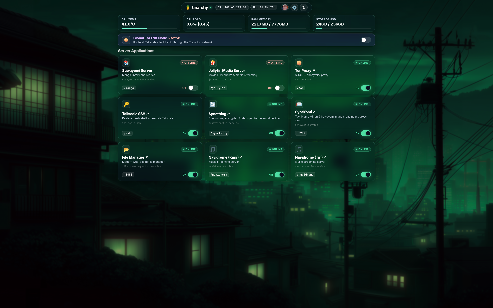
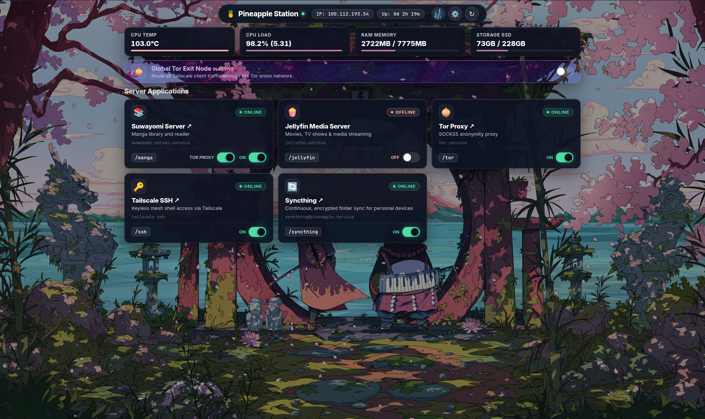
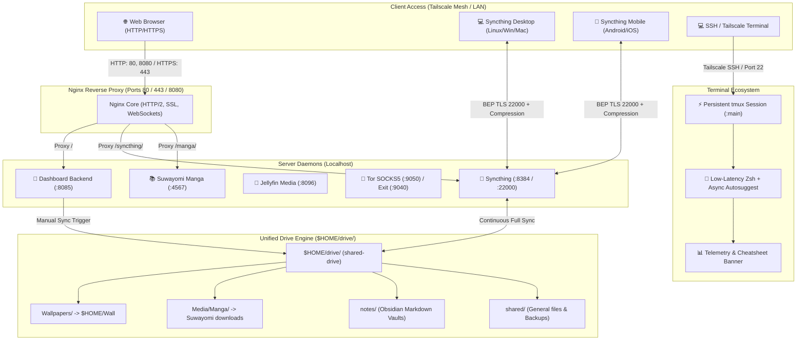

# 🍍 Pinedash (Server Ecosystem & Control Center)


[](https://archlinux.org)
[](https://python.org)
[](https://nginx.org)
[](https://tailscale.com)
[](https://syncthing.net)
[](https://github.com/tmux/tmux)
[](https://1.1.1.1)

A fast, lightweight, and translucent glassmorphic control center for self-hosted Linux home servers and headless machines. Built with native Python, unified Nginx reverse proxying, dynamic **Pywal** theming, automated **$HOME/drive/** synchronization, encrypted **DNS-over-TLS**, end-to-end encrypted **Syncthing full shared folder sync with LZ4/Zstandard compression**, **Tor anonymity routing**, persistent **Tailscale SSH & tmux** sessions, and **hardware display power management**.

---

## 📸 Interface Previews

### 💻 Tin's Setup (`tinarchy`)
[](public/screenshots/tinarchy-preview.png)

### 🍍 Pineapple's Setup (`Pineapple Station`)
[](public/screenshots/pineapple-preview.png)

> *Dynamic Pywal palette generation, frosted glassmorphism, and live telemetry across different home server environments.*

---

## 🌟 Key Features

- **🎨 Dynamic Pywal Theming & Live Wallpapers**:
  - Automatically samples color palettes from 150+ static images and animated MP4 video files.
  - Intelligently tunes luminance ($L \in [0.72, 0.85]$) and contrast for frosted glass readability.
  - Pre-renders lightweight `.webp` thumbnails for instant, flicker-free wallpaper switching.
  - **Live Glassmorphic Sliders**: Real-time slider controls for background blur and glass translucency with immediate cross-page synchronization between `/settings` and the main dashboard.
  - **Adaptive Small-Screen Layouts**: Responsive single-column list view with compact tiles on mobile phones and small viewports without horizontal or vertical overflow.

- **⚡ Persistent Remote SSH & Terminal Ecosystem (tmux + Zsh)**:
  - **Automatic Session Persistence**: Interactive SSH and Tailscale SSH logins automatically attach to a persistent `tmux` session (`main`). Running builds, downloads, and servers never get killed if Wi-Fi drops or your client machine sleeps.
  - **Pinedash-Themed tmux (`configs/tmux/tmux.conf`)**: Features 50,000 lines of scrollback, full mouse scrolling & selection, instant 0ms Esc-key modal switching for Vim/Neovim, truecolor RGB, and custom glass-matching status bar badges.
  - **Optimized Zsh Shell (`configs/zsh/zshrc`)**: Tuned for ultra-low latency over remote SSH connections with async autosuggestions, non-blocking buffer limits, and custom syntax highlighting colors.
  - **Zero-Overhead Cheatsheets**: Instant built-in tmux keyboard shortcuts reference table (`tmux-keys` / `shortcuts`) without shell launch delay.
  - **Bypass Flag**: Non-interactive commands execute directly; to bypass tmux in an interactive shell, simply connect with `NO_AUTO_TMUX=1 ssh ...`.

- **💻 Headless Laptop Server Display & Power Management**:
  - **True 0-Watt LCD Screen Sleep**: Configures VESA DPMS hardware powerdown (`bl_power = 4`, `actual_brightness = 0`) after 3 minutes of console inactivity instead of keeping the backlight burning.
  - **ACPI Lid Handling**: Automatically turns off the display backlight instantly when the laptop lid is closed while keeping all 24/7 background server processes, Tailscale, and Nginx running.
  - **Instant Keyboard Wake**: Hitting any key on the physical console immediately wakes up the screen with full brightness.

- **🌐 Unified Reverse Proxy & Smart Routing (Nginx)**:
  - Consolidates all web services under standard HTTP (`80`, `8080`) and HTTPS (`443`) ports.
  - Path-based routing: `/` (Dashboard), `/syncthing/` (Syncthing Web GUI), `/syncthing` (Syncthing Guide), `/manga/` & `/api/v1/` (Suwayomi), `/ssh` (Persistent SSH Guide).
  - Clean pseudo links: `/links/<service>` (`/links/manga`, `/links/syncthing`, `/links/navidrome`, etc.) for direct browser redirection.

- **⚡ Multi-Trigger `$HOME/drive/` Synchronization Engine**:
  - Unifies storage (wallpapers, manga, note vaults, and media) into a clean `$HOME/drive/` hierarchy with zero duplication.
  - Debounced automated triggers:
    1. System boot via `pinedash-drive-sync.service`
    2. Interactive dashboard button (`[ ⚡ Sync Now ]` at `/api/drive/sync`)
  - Automated cloud backups to Google Drive via rclone (`configs/scripts/backup-drive-to-gdrive.sh` + systemd timer).

- **🔄 Syncthing Full Shared Folder Sync with File Compression**:
  - Decentralized, real-time bidirectional synchronization of the entire `$HOME/drive/` folder across all personal devices (Desktop & Mobile).
  - Enforced file and block-level compression (`compression="always"`) via LZ4/Zstandard to minimize mobile data consumption and maximize transfer speed.
  - Dedicated interactive setup guide with one-click Device ID copying, folder ID configuration (`shared-drive`), and OS-specific tabs at `/syncthing`.
  - Multi-tier zero-trust guest isolation: network-layer Tailscale ACL block, application-layer cryptographic mutual TLS device pairing, and dashboard-level RBAC route gating.

- **📝 Native Obsidian Vault & Notes Sync (Syncthing)**:
  - Obsidian vaults sync seamlessly as standard Markdown folders within `$HOME/drive/notes/` via Syncthing.
  - Zero database overhead, complete offline note availability on iOS/Android/Desktop, and preconfigured `.stignore` rules for workspace layouts.

- **🧅 Tor SOCKS5 Proxy & Global Tailscale Exit Node**:
  - Standalone SOCKS5 proxy on `127.0.0.1:9050` with per-service toggling.
  - Global Exit Node routing: routes all Tailscale client traffic through Tor via `iptables` NAT tables, with intelligent auto-start when toggled.

- **👥 Role-Based Access Control (RBAC) & Tailscale Identity**:
  - Dynamic user and device identification via Tailscale Whois (no manual credentials required).
  - Tiers configured in `roles_config.json`:
    - `owner`: Full unrestricted telemetry, service controls, Tor exit node, and connected Tailnet device inspection.
    - `admin`: Service start/stop/restart and Tor proxy controls.
    - `viewer`: Read-only telemetry and allowed service links.
    - `guest`: Isolated view restricted to whitelisted services (e.g. personal Navidrome, FileBrowser); Tor exit node and Tailnet device sections are automatically hidden.
  - Robust multi-user identity resolution: prevents duplicate "You" badges across multiple connected devices on the same tailnet account.

- **🧩 Extensible Local Services (`services.local.json`)**:
  - Register machine-specific or private services (such as multi-user Navidrome instances) without touching Git-tracked code.

---

## 🏗️ System Architecture



---

## 📋 Port & Service Reference

| Service | Internal Port | External Path / Port | Systemd Service | Description |
| :--- | :---: | :---: | :--- | :--- |
| **Dashboard Backend** | `8085` | `/` (80, 8080, 443) | `tinarchy.service` (alias: `server-dashboard.service`) | Glassmorphic telemetry & control center |
| **Syncthing Web GUI** | `8384` | `/syncthing` & `/syncthing/` | `syncthing@<user>.service` | Continuous full folder sync with LZ4 compression |
| **FileBrowser Quantum** *(Optional)* | `8082` | `/files/` & `:8081` | `filebrowser-quantum.service` | Modern web file manager (enable via `ENABLE_FILEBROWSER=true`) |
| **Obsidian LiveSync** *(Optional)* | `5984` | `/obsidian` & `/couchdb/` | `couchdb.service` | Real-time E2EE note synchronization (enable via `ENABLE_COUCHDB=true`) |
| **SyncYomi Server** *(Optional)* | `8282` | `/syncyomi` & `:8282` | `syncyomi.service` | Tachiyomi, Mihon & Suwayomi reading progress sync (enable via `ENABLE_SYNCYOMI=true`) |
| **Jellyfin Media** | `8096` | `:8096` | `jellyfin.service` | Movies, TV shows & media streaming |
| **Tor SOCKS5 Proxy** | `9050` | `:9050` | `tor.service` | SOCKS5 anonymity proxy |
| **Global Tor Exit Node** | `9040` / `5353` | `tailscale0` NAT | `tor_exit_node.sh` | Routes Tailnet client traffic over Tor |
| **SSH & tmux Persistence** | `22` | `:22` | `sshd.service` / `tmux` | Resilient remote sessions with auto-attach |

---

## 🚀 Quick Start & Installation

### 1. Prerequisites

Install core runtime dependencies:

```bash
# Arch Linux
sudo pacman -S python python-pillow nginx tor iptables tailscale rclone tmux zsh syncthing

# Debian / Ubuntu
sudo apt update && sudo apt install -y python3 python3-pil nginx tor iptables rclone tmux zsh syncthing
```

### 2. Clone the Repository
 
```bash
git clone https://github.com/T1n777/Tinarchy.git ~/Tinarchy
cd ~/Tinarchy

# Optional backward-compatibility symlink for existing scripts
ln -s ~/Tinarchy ~/server-dashboard
```

### 3. Automated Interactive Installation (Recommended)

Run the master interactive installer to choose and configure components:

```bash
cd ~/Tinarchy
./install.sh
```

The installer prompts for each server individually upfront, batch installs package dependencies, applies all configurations, activates systemd daemons, and credits upstream creators. For non-interactive unattended installation:

```bash
./install.sh --yes
```

---

### 4. Manual Configuration (Advanced)

#### A. Centralized Environment Engine (`.env`)
Copy the provided `.env.example` template to configure your instance:

```bash
cp .env.example .env
```

Key configuration variables:
- `PROJECT_NAME`: Instance brand title (e.g. `Tinarchy`, `Pinedash`, or your custom label).
- `SERVER_NAME`: Display name for the host (defaults to system hostname).
- `APP_ICON`: Top-nav brand emoji or symbol (e.g. `🍍`, `⚡`, `🚀`).
- `BRANDING_SUBTITLE`: Subtitle shown on headers and login.
- `SSH_USER`: Default SSH username shown in guides and command generators.
- `PORT`: Internal dashboard HTTP port (default: `8085`).
- `TAILSCALE_DOMAIN`: Optional MagicDNS domain override (automatically detected via Tailscale if left blank).
- `ENABLE_SYNCYOMI`: Optional toggle (`true`/`false`) to activate SyncYomi manga synchronization service and tile (default: `false`).
- `SYNCYOMI_PORT`: SyncYomi daemon port (default: `8282`).

#### B. Access Roles (`roles_config.json`)
Assign roles based on Tailscale login emails (`owner`, `admin`, `guest`, `viewer`):
```json
{
  "owner": "admin@example.com",
  "owner_name": "Admin",
  "roles": {
    "admin@example.com": "owner",
    "friend@example.com": "admin",
    "guest@example.com": "guest"
  },
  "default_role": "viewer"
}
```

#### C. Local Machine Services (`services.local.json`, Optional)
Add untracked machine-specific services (e.g. Navidrome instances):
```json
[
  {
    "id": "navidrome",
    "name": "Navidrome",
    "port": 4533,
    "systemd": "navidrome",
    "icon": "🎵",
    "description": "Personal Music Streaming Server"
  }
]
```

---

### 5. Deploy Systemd Services

Deploy the dashboard unit file:

```bash
# Deploy Dashboard service
sudo cp configs/systemd/tinarchy.service /etc/systemd/system/
sudo systemctl daemon-reload
sudo systemctl enable --now tinarchy.service
```

Additional service unit templates are available under `configs/systemd/`:
- `syncthing@<user>.service` (systemd user/system service for background folder sync)
- `pinedash-drive-sync.service`
- `rclone-drive-backup.service` & `rclone-drive-backup.timer`
- `cloudflare-dot.conf` (DNS-over-TLS)
- `console-screen-blank.service` & `getty-powersave.conf` (Display powerdown)
- `syncyomi.service` (SyncYomi reading progress synchronization daemon)

---

### 6. Install the Drive Sync Engine

Set up the unified `$HOME/drive/` sync script and background service:

```bash
# Install sync binary
sudo cp configs/scripts/tinarchy-drive-sync /usr/local/bin/
sudo chmod +x /usr/local/bin/tinarchy-drive-sync
sudo ln -sfn /usr/local/bin/tinarchy-drive-sync /usr/local/bin/pinedash-drive-sync

# Enable background boot trigger service
sudo cp configs/systemd/pinedash-drive-sync.service /etc/systemd/system/
sudo systemctl daemon-reload
sudo systemctl enable --now pinedash-drive-sync.service
```

---

### 7. Configure Nginx Reverse Proxy

1. Review and adjust `configs/nginx/nginx.conf` (ensure usernames, SSL certificate paths, and server names match your machine).
2. Copy configuration to `/etc/nginx/nginx.conf`:
   ```bash
   sudo cp configs/nginx/nginx.conf /etc/nginx/nginx.conf
   sudo nginx -t && sudo systemctl restart nginx
   ```

---

### 8. Configure Tor Exit Node (Optional)

Make the exit node script executable:
```bash
chmod +x ~/Tinarchy/tor_exit_node.sh
```

To allow the dashboard backend to toggle the Tor exit node without password prompts, add a sudoers rule (`sudo visudo -f /etc/sudoers.d/99-tor-exit`):
```text
%wheel ALL=(ALL) NOPASSWD: /home/*/Tinarchy/tor_exit_node.sh *, /home/*/server-dashboard/tor_exit_node.sh *
```

---

### 9. Configure Persistent SSH & Terminal (tmux + Zsh)

Install the low-latency Zsh configuration and persistent tmux environment:

```bash
# Copy and activate shell and tmux configs
cp configs/zsh/zshrc ~/.zshrc
cp configs/tmux/tmux.conf ~/.tmux.conf
```

---

### 10. Headless Laptop Display Powerdown (Optional)

For home server laptops running 24/7 with the lid open or closed, enforce true hardware DPMS backlight shutoff after 3 minutes of console inactivity:

```bash
# 1. Install systemd getty powersave drop-in (enforces root DPMS powerdown on login prompts)
sudo mkdir -p /etc/systemd/system/getty@.service.d
sudo cp configs/systemd/getty-powersave.conf /etc/systemd/system/getty@.service.d/powersave.conf

# 2. Install interactive shell powersave trigger
sudo cp configs/scripts/console-powersave.sh /etc/profile.d/console-powersave.sh

# 3. Add consoleblank=180 to GRUB_CMDLINE_LINUX_DEFAULT in /etc/default/grub and update GRUB:
sudo grub-mkconfig -o /boot/grub/grub.cfg

# 4. Reload systemd
sudo systemctl daemon-reload
```

---

### 11. Syncthing Continuous Cross-Platform Sync Setup

Syncthing delivers private, continuous, decentralized folder synchronization across all your personal devices without sending data through third-party cloud servers.

#### A. Client Installation by Platform

* **🐧 Linux (Arch / Debian / Ubuntu / Fedora)**:
  ```bash
  # Arch Linux
  sudo pacman -S syncthing
  systemctl --user enable --now syncthing

  # Ubuntu / Debian
  sudo apt update && sudo apt install -y syncthing
  systemctl --user enable --now syncthing

  # Fedora
  sudo dnf install syncthing
  systemctl --user enable --now syncthing
  ```
  Once started, access the local client Web GUI in your browser at `http://127.0.0.1:8384`.

* **🪟 Windows**:
  1. Download **[SyncTrayzor](https://github.com/canton7/SyncTrayzor/releases)** (recommended for desktop tray integration, built-in file watching, and auto-start) or the official installer from [syncthing.net](https://syncthing.net).
  2. Run the installer and enable **Start on Windows login**.
  3. The tray icon opens the Syncthing Web GUI at `http://localhost:8384`.

* **📱 Mobile Phones**:
  * **Android**:
    1. Install **[Syncthing-Fork](https://github.com/Catfriend1/syncthing-android)** from Google Play or F-Droid (preferred over stock for modern Android scoped storage and battery optimization).
    2. Under **Settings** ➔ **Run Conditions**, configure when syncing runs (e.g. *Only on Wi-Fi* or *Only while charging*) to preserve battery.
  * **iOS (iPhone / iPad)**:
    1. Install **[Möbius Sync](https://www.mobiussync.com/)** from the Apple App Store.
    2. Möbius Sync bundles Syncthing internally and integrates with the native iOS **Files** app.

---

#### B. Step-by-Step Device Pairing

Syncthing uses mutual cryptographic TLS with 56-character Device IDs. Both devices must add each other before any sync can occur:

1. **Get the Server's Device ID**:
   * Open the dashboard at `/syncthing` (or navigate to `http://<server-tailscale-ip>:8384` on the server).
   * Copy the 56-character **Server Device ID** (or scan the QR code).

2. **Add Server on Client Device**:
   * Open Syncthing on your client device (`http://127.0.0.1:8384` on desktop, or the mobile app).
   * Click / tap **Add Remote Device** (bottom right on desktop).
   * Paste the Server Device ID into the **Device ID** field.
   * Under **Device Name**, label it (e.g. `tinarchy` or `Home Server`).
   * Under the **Advanced** tab ➔ **Addresses**, enter:
     ```text
     tcp://<server-tailscale-ip>:22000, dynamic
     ```
   * Click **Save**.

3. **Approve on the Server**:
   * Open the server's Syncthing GUI at `http://<server-tailscale-ip>:8384` (or via the dashboard tile `/syncthing`).
   * A prompt will appear: *`New Device "Device-ID" wants to connect`*.
   * Click **Add Device** ➔ check **Auto Accept Folders** (optional, recommended for trusted owner devices) ➔ click **Save**.
   * Status will transition to **Connected** over TLS 1.3.

---

#### C. Adding & Sharing Folders

1. **Add Folder on Client**:
   * In the client GUI / app, click **Add Folder**.
   * **General Tab**:
     * **Folder Label**: A human-friendly display name (e.g. `Notes`, `Documents`, or `Camera Backup`).
     * **Folder ID**: A unique identifier string (e.g. `default`, `obsidian-vault`, or `phone-photos`). **This Folder ID must match on both machines.**
     * **Folder Path**: Select your local folder path (e.g. `~/Documents/Notes` on Linux, `C:\Users\<user>\Documents\Notes` on Windows, or `/storage/emulated/0/DCIM` on Android).
   * **Sharing Tab**:
     * Check the checkbox for your server (e.g. `tinarchy`).
   * Click **Save**.

2. **Accept Folder on Server**:
   * If *Auto Accept Folders* is enabled, the server creates the folder automatically under `~/Sync/<folder-id>`.
   * Otherwise, click **Add** on the server's incoming share notification, set your desired server storage path (e.g. `/home/<user>/Documents/Notes` or `/home/<user>/drive/notes/`), and click **Save**.

3. **Recommended Ignore Patterns (`.stignore`)**:
   For synchronized workspaces and Obsidian vaults, prevent transient caches and layout conflicts across devices by adding these patterns under **Folder Edit** ➔ **Ignore Patterns** (or in a `.stignore` file in the folder root):
   ```text
   (?d)**/.obsidian/workspace.json
   (?d)**/.obsidian/workspace-mobile.json
   (?d)**/.obsidian/cache
   (?d)**/.trash
   (?d).DS_Store
   (?d)desktop.ini
   (?d)Thumbs.db
   ```

---

### 12. Optional: SyncYomi Manga Synchronization Setup

SyncYomi synchronizes reading progress, library status, bookmarks, and read history across **Suwayomi-Server** (desktop/server) and **Komikku / Tachiyomi / Mihon** (Android mobile devices).

#### A. Automated Server Installation
Run the turnkey installation script included in the repository:
```bash
sudo ./configs/scripts/install-syncyomi.sh
```
This automatically fetches the latest release, registers the dedicated `syncyomi` system user, initializes `/var/lib/syncyomi/`, deploys `syncyomi.service`, and enables it.

Alternatively, install via AUR on Arch Linux:
```bash
yay -S syncyomi-git
```

#### B. Enable in Dashboard
In your server's `.env` file, activate the service:
```ini
ENABLE_SYNCYOMI=true
SYNCYOMI_PORT=8282
```
Then reload the dashboard:
```bash
sudo systemctl restart tinarchy
```

#### C. Pair Suwayomi & Mobile Devices
1. Open the SyncYomi web dashboard at `http://<tailscale-ip>:8282` and create your admin account.
2. In SyncYomi, go to **Settings** ➔ **API Keys** ➔ click **Add API Key** and copy the generated token.
3. Access the interactive setup guide at `/syncyomi` on your dashboard for live connection snippets for Suwayomi's `server.conf` and Komikku on Android.

---

## 🛠️ Management & Useful Commands

| Task | Command |
| :--- | :--- |
| **Check Dashboard Status** | `systemctl status tinarchy` (or `server-dashboard`) |
| **View Live Dashboard Logs** | `journalctl -u tinarchy -f` |
| **Restart Dashboard Service** | `sudo systemctl restart tinarchy` |
| **Check Syncthing Status** | `systemctl status syncthing@<user>` (server) / `systemctl --user status syncthing` (client) |
| **View Syncthing Logs** | `journalctl -u syncthing@<user> -f` |
| **Check SyncYomi Status** | `systemctl status syncyomi` |
| **View SyncYomi Logs** | `journalctl -u syncyomi -f` |
| **Trigger Manual Drive Sync** | `curl -X POST http://127.0.0.1:8085/api/drive/sync` |
| **Test Nginx Configuration** | `sudo nginx -t` |
| **Check Tor Exit Node Status** | `sudo iptables -t nat -L TOR_EXIT -n -v` |
| **Check Tailscale Peer Status**| `tailscale status` |
| **Attach to Persistent Terminal** | `tmux attach -t main` |
| **Bypass Persistent tmux on SSH** | `NO_AUTO_TMUX=1 ssh user@host` |
| **View Telemetry & tmux Cheatsheet** | `shortcuts` or `tmux-keys` or `ff` |

---

## 🔒 Security & Isolation Model

1. **Tailscale Whois Identity**: Authenticates users dynamically based on verified WireGuard mesh identities.
2. **Guest Isolation**: Guest accounts only see explicitly permitted services. Management toggles (Tor exit node, service daemons, and connected Tailnet peers) are excluded both from the API and the UI.
3. **Mutual Cryptographic Pairing & TLS 1.3**: Syncthing requires explicit reciprocal 56-character Device ID fingerprint authorization, ensuring no unauthenticated device can ever access or sync the drive.
4. **Leak-Proof Tor Routing**: The Tor exit node script rejects non-TCP/DNS traffic and filters IPv6 to prevent accidental deanonymization.
5. **Persistent Session Sandboxing**: Remote SSH sessions are contained in detachable tmux sessions, preventing abrupt network drops from terminating background administration jobs.

---

## 📄 License

Released under the [MIT License](LICENSE). Built for self-hosters, home lab enthusiasts, and Linux power users.
