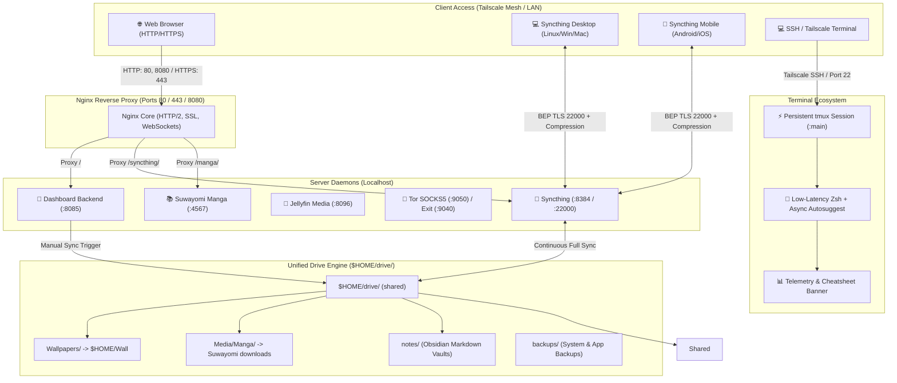

# 🍍 Pinedash (Server Ecosystem & Control Center)


[](https://archlinux.org)
[](https://python.org)
[](https://nginx.org)
[](https://tailscale.com)
[](https://syncthing.net)
[](https://github.com/tmux/tmux)
[](https://1.1.1.1)

A fast, lightweight, and translucent glassmorphic control center for self-hosted Linux home servers and headless machines. Built with native Python, unified Nginx reverse proxying, dynamic **Pywal** theming, automated **$HOME/drive/** synchronization, encrypted **DNS-over-TLS**, end-to-end encrypted **Syncthing full shared folder sync with LZ4/Zstandard compression**, **Tor anonymity routing**, persistent **Tailscale SSH & tmux** sessions, and **hardware display power management**.

---

## 📸 Interface Previews

### 💻 Tin's Setup (`tinarchy`)
[](public/screenshots/tinarchy-preview.png)

### 🍍 Pineapple's Setup (`Pineapple Station`)
[](public/screenshots/pineapple-preview.png)

> *Dynamic Pywal palette generation, frosted glassmorphism, and live telemetry across different home server environments.*

---

## 🌟 Key Features

- **🎨 Dynamic Pywal Theming & Live Wallpapers**:
  - Automatically samples color palettes from 150+ static images and animated MP4 video files.
  - Intelligently tunes luminance ($L \in [0.72, 0.85]$) and contrast for frosted glass readability.
  - Pre-renders lightweight `.webp` thumbnails for instant, flicker-free wallpaper switching.
  - **Live Glassmorphic Sliders**: Real-time slider controls for background blur and glass translucency with immediate cross-page synchronization between `/settings` and the main dashboard.
  - **📱 Per-Device UI Scaling & Display Size**: Integrated interface scaling in Settings (`85%` to `125%`) with 1-click preset chips (**Compact 90%**, **Default 100%**, **Comfortable Laptop 108%**, **Large 115%**). Stored locally per device via `localStorage` so laptops scale up comfortably without enlarging the mobile view.
  - **Adaptive Small-Screen Layouts**: Responsive single-column list view with compact tiles on mobile phones and small viewports without horizontal or vertical overflow.

- **⚡ Modular Backend Architecture & Real-Time SSE Telemetry Streaming**:
  - **Modular Package Structure (`tinarchy/`)**: Decoupled monolithic server into dedicated submodules (`telemetry`, `sse`, `services`, `auth`, `syncthing`, `reports`, `config`) while maintaining 100% backward compatibility for existing external scripts and REST endpoints.
  - **Smart Delta Server-Sent Events (SSE)**: Streams live system telemetry via `/api/events/telemetry`. Sends initial full snapshot on connection, then lightweight ~500B dynamic delta frames on 2s ticks, reducing telemetry bandwidth by >50% and eliminating redundant disk `statvfs` calls.
  - **Ultra-Fast Tailscale UNIX Domain Socket Resolution**: Connects directly to `/run/tailscale/tailscaled.sock` via Python's native `http.client` (<2ms WHOIS latency, 7.6x faster) eliminating subshell fork overhead.
  - **In-Memory API Micro-Caching**: Thread-safe micro-caches for `/api/reports/daily` (5s TTL, 134x speedup) and `/api/services` (2.5s TTL, 28x speedup) with automated invalidation when services are toggled.
  - **Instant 0ms App Shell & Offline PWA (`sw.js`)**: Stale-While-Revalidate service worker caches static assets, navigation shells, and SVG icons for instantaneous cold starts. Parallel Google Font preconnects and native system font fallbacks eliminate typography render blocking (FOIT).
  - **Nginx Upstream Keepalive & Zero-Buffering**: Persistent connection pool (`keepalive 32;`) eliminates TCP socket churn between Nginx and Python backend, with dedicated unbuffered proxying for real-time SSE streams.
  - **Graceful Fallback Polling**: Client uses native browser `EventSource` with automated fallback to interval polling if disconnected or unsupported.

- **⚡ Persistent Remote SSH & Terminal Ecosystem (tmux + Zsh)**:
  - **Automatic Session Persistence**: Interactive SSH and Tailscale SSH logins automatically attach to a persistent `tmux` session (`main`). Running builds, downloads, and servers never get killed if Wi-Fi drops or your client machine sleeps.
  - **Pinedash-Themed tmux (`configs/tmux/tmux.conf`)**: Features 50,000 lines of scrollback, full mouse scrolling & selection, instant 0ms Esc-key modal switching for Vim/Neovim, truecolor RGB, and custom glass-matching status bar badges.
  - **Optimized Zsh Shell (`configs/zsh/zshrc`)**: Tuned for ultra-low latency over remote SSH connections with async autosuggestions, non-blocking buffer limits, and custom syntax highlighting colors.
  - **Zero-Overhead Cheatsheets**: Instant built-in tmux keyboard shortcuts reference table (`tmux-keys` / `shortcuts`) without shell launch delay.
  - **Bypass Flag**: Non-interactive commands execute directly; to bypass tmux in an interactive shell, simply connect with `NO_AUTO_TMUX=1 ssh ...`.

- **💻 Headless Laptop Server Display & Power Management**:
  - **True 0-Watt LCD Screen Sleep**: Configures VESA DPMS hardware powerdown (`bl_power = 4`, `actual_brightness = 0`) after 3 minutes of console inactivity instead of keeping the backlight burning.
  - **ACPI Lid Handling**: Automatically turns off the display backlight instantly when the laptop lid is closed while keeping all 24/7 background server processes, Tailscale, and Nginx running.
  - **Instant Keyboard Wake**: Hitting any key on the physical console immediately wakes up the screen with full brightness.

- **🌐 Unified Reverse Proxy & Smart Routing (Nginx)**:
  - Consolidates all web services under standard HTTP (`80`, `8080`) and HTTPS (`443`) ports.
  - Path-based routing: `/` (Dashboard), `/syncthing/` & `/syncthing-gui` (Syncthing Web GUI), `/syncthing` (Syncthing Guide), `/manga/` & `/api/v1/` (Suwayomi), `/ssh` (Persistent SSH Guide).
  - Clean pseudo links: `/links/<service>` (`/links/manga`, `/links/syncthing`, `/syncthing-gui`, `/links/navidrome`, etc.) for direct browser redirection.

- **📚 Persistent Manga Thumbnail Caching & Zero-JVM Latency (Suwayomi + Nginx)**:
  - **Reboot-Persistent Storage**: Relocates Suwayomi's temporary JVM cache (`java.io.tmpdir`) from ephemeral `/tmp` to permanent SSD storage (`/var/lib/suwayomi/cache/`), preventing cache wipeouts across system reboots.
  - **Zero-JVM Nginx Fast-Path**: Serves cached manga covers directly at kernel `sendfile` speeds (< 1ms latency) via Nginx `proxy_cache`, bypassing Java threads for 99% of requests.
  - **Automated Background Pre-Cacher**: Proactively pre-downloads missing library covers in the background with gentle rate-limiting, eliminating UI spinner stalls when scrolling through large collections.

- **🛡️ Headless JCEF Browser & Cloudflare Bypass (Xvfb + FlareSolverr)**:
  - **Virtual X11 Framebuffer (`xvfb.service`)**: Runs a lightweight X Virtual Framebuffer (`:99`) allowing Suwayomi's embedded Chromium / CEF (`jcef_helper`) runtime to execute headlessly on Linux servers without Xorg desktop overhead or crashes.
  - **Universal FlareSolverr Docker Engine (`:8191`)**: Automatically bypasses Cloudflare bot protection and Turnstile captchas for stubborn manga extensions (Comix, Vortex, etc.), maintaining reliable background scraping and library updates.
  - **Automated Drop-In Isolation**: Systemd drop-in wiring binds `DISPLAY=:99` and JVM library paths directly into `suwayomi-server.service.d/` with graceful fallback if services are absent.

- **🌡️ Autonomous Closed-Loop Thermal PID Governor & Dynamic Ladder**:
  - **Real-Time Dynamic Throttling**: Monitors CPU package temperatures ($T(t)$), rate of temperature climb ($dT/dt$), and user inactivity.
  - **4-Tier Operational Ladder**: Automatically scales between Tier 0 (Active / whisper-quiet at 76°C with Suwayomi CPU capped) and Tier 3 (Unconstrained Sprint at 84°C unlocking full Intel Turbo Boost 3.10GHz for background batch jobs).
  - **Instant User Wakeup (< 3s)**: Snaps back to Tier 0 the instant a keystroke is registered in SSH or media streaming begins on Jellyfin.

- **🌐 Dynamic Multicore Network & Adaptive Memory Autotuner (RPS/RFS, BBR & Hardware Profiles)**:
  - **Universal Multicore Steering**: Distributes network packet processing across all CPU cores (`rps_cpus = f`) on active Wi-Fi, Ethernet, and Tailscale interfaces.
  - **TCP Buffer & BBR Autotuning**: Dynamically sizes kernel TCP socket buffers up to 64MB and activates BBR congestion control for maximum throughput across high-latency remote links.
  - **Adaptive Hardware-Aware Memory Profiling**: Automatically detects whether the host uses modern in-memory compressed ZRAM (`/dev/zram0`) or physical disk swap (`/swapfile`):
    - **ZRAM Profile (`profiles/zram.conf`)**: Enables `swappiness = 150` with seekless single-page faults and 256MB writeback bounds, multiplying effective RAM by ~3.3x without SSD thrashing or I/O freezes.
    - **Physical Disk-Swap Profile (`profiles/disk-swap.conf`)**: Yashwanth's classic low-swappiness tuning (`swappiness = 30`, `dirty_ratio = 50`) engineered to protect physical SSD/HDD swapfiles on older laptops while aggressively holding directory inode trees in RAM (`vfs_cache_pressure = 10`).
    - **Zero-Config Installer**: `install.sh` automatically probes `/proc/swaps` and `/dev/zram0` on install, or accepts manual `HARDWARE_MEMORY_PROFILE` overrides from `.env`.

- **⚡ Multi-Trigger `$HOME/drive/` Synchronization Engine**:
  - Unifies storage (wallpapers, manga, note vaults, and media) into a clean `$HOME/drive/` hierarchy with zero duplication.
  - Debounced automated triggers:
    1. System boot via `pinedash-drive-sync.service`
    2. Interactive dashboard button (`[ ⚡ Sync Now ]` at `/api/drive/sync`)
  - Automated cloud backups to Google Drive via rclone (`configs/scripts/backup-drive-to-gdrive.sh` + systemd timer).

- **🔄 Syncthing Full Shared Folder Sync with File Compression**:
  - Decentralized, real-time bidirectional synchronization of the entire `$HOME/drive/` folder across all personal devices (Desktop & Mobile).
  - Enforced file and block-level compression (`compression="always"`) via LZ4/Zstandard to minimize mobile data consumption and maximize transfer speed.
  - Dedicated interactive setup guide with one-click Device ID copying, folder ID configuration (`shared`), and OS-specific tabs at `/syncthing`.
  - Multi-tier zero-trust guest isolation: network-layer Tailscale ACL block, application-layer cryptographic mutual TLS device pairing, and dashboard-level RBAC route gating.

- **📝 Native Obsidian Vault & Notes Sync (Syncthing)**:
  - Obsidian vaults sync seamlessly as standard Markdown folders within `$HOME/drive/notes/` via Syncthing.
  - Zero database overhead, complete offline note availability on iOS/Android/Desktop, and preconfigured `.stignore` rules for workspace layouts.

- **🧅 Tor SOCKS5 Proxy & Global Tailscale Exit Node**:
  - Standalone SOCKS5 proxy on `127.0.0.1:9050` with per-service toggling.
  - Global Exit Node routing: routes all Tailscale client traffic through Tor via `iptables` NAT tables, with intelligent auto-start when toggled.

- **👥 Role-Based Access Control (RBAC) & Tailscale Identity**:
  - Dynamic user and device identification via Tailscale Whois (no manual credentials required).
  - Tiers configured in `roles_config.json`:
    - `owner`: Full unrestricted telemetry, service controls, Tor exit node, and connected Tailnet device inspection.
    - `admin`: Service start/stop/restart and Tor proxy controls.
    - `viewer`: Read-only telemetry and allowed service links.
    - `guest`: Isolated view restricted to whitelisted services (e.g. personal Navidrome, FileBrowser); Tor exit node and Tailnet device sections are automatically hidden.
  - Robust multi-user identity resolution: prevents duplicate "You" badges across multiple connected devices on the same tailnet account.

- **🧩 Extensible Local Services (`services.local.json`)**:
  - Register machine-specific or private services (such as multi-user Navidrome instances) without touching Git-tracked code.

---

## 🏗️ System Architecture



### 🧩 Modular Backend Core (`tinarchy/`)

The monolithic server has been decomposed into a decoupled, thread-safe Python package structure:

```
server-dashboard/
├── server.py              # Lightweight HTTP router, SSE dispatcher & backward-compatible re-exports
├── tinarchy/              # Modular backend core package
│   ├── config.py          # Centralized environment, filesystem paths, and dynamic branding loader
│   ├── telemetry.py       # Pure sysfs/proc hardware collectors (CPU, RAM, Disks, Network, Battery)
│   ├── sse.py             # Thread-safe Server-Sent Events broker with auto-idling when clients = 0
│   ├── services.py        # Systemd service registry, status matrix, lifecycle actions, and Tor toggles
│   ├── auth.py            # Tailscale WHOIS resolution and RBAC enforcement (owner, admin, viewer, guest)
│   ├── syncthing.py       # Syncthing CLI daemon, device ID resolution, and pairing worker
│   └── reports.py         # Autonomous daily markdown system report generator
```

---

## 📋 Port & Service Reference

| Service | Internal Port | External Path / Port | Systemd Service | Description |
| :--- | :---: | :---: | :--- | :--- |
| **Dashboard Backend** | `8085` | `/` (80, 8080, 443) | `tinarchy.service` (alias: `server-dashboard.service`) | Glassmorphic telemetry & control center |
| **Syncthing Web GUI** | `8384` | `/syncthing/` & `/syncthing-gui` | `syncthing@<user>.service` | Continuous full folder sync with LZ4 compression |
| **Syncthing Setup Guide** | — | `/syncthing` | `tinarchy.service` | Interactive client setup, OS tabs & 1-click Device ID pairing |
| **FileBrowser Quantum** *(Optional)* | `8082` | `/files/` & `:8081` | `filebrowser-quantum.service` | Modern web file manager (enable via `ENABLE_FILEBROWSER=true`) |
| **Obsidian LiveSync** *(Optional)* | `5984` | `/obsidian` & `/couchdb/` | `couchdb.service` | Real-time E2EE note synchronization (enable via `ENABLE_COUCHDB=true`) |
| **SyncYomi Server** *(Optional)* | `8282` | `/syncyomi` & `:8282` | `syncyomi.service` | Tachiyomi, Mihon & Suwayomi reading progress sync (enable via `ENABLE_SYNCYOMI=true`) |
| **Suwayomi Manga Server** *(Optional)* | `4567` | `/manga/` & `:4567` | `suwayomi-server.service` | Manga reader with persistent SSD thumbnail cache & Nginx fast-path |
| **X Virtual Framebuffer (Xvfb)** | — | Display `:99` | `xvfb.service` | Headless X11 display for Suwayomi JCEF/Chromium extension engine |
| **FlareSolverr Proxy** *(Optional)* | `8191` | `:8191` | `docker-compose.flaresolverr.yml` | Cloudflare Turnstile & challenge bypass proxy for manga scrapers |
| **Resource Governor** | — | Telemetry `/api/reports/daily` | `tinarchy-resource-governor.service` | Autonomous closed-loop PID thermal budget & workload governor |
| **Dynamic Network Tuner** | — | Sysctl / RPS | `tinarchy-net-autotune.service` | Multicore RPS/RFS packet steering & TCP buffer autotuning |
| **Jellyfin Media** | `8096` | `:8096` | `jellyfin.service` | Movies, TV shows & media streaming |
| **Tor SOCKS5 Proxy** | `9050` | `:9050` | `tor.service` | SOCKS5 anonymity proxy |
| **Global Tor Exit Node** | `9040` / `5353` | `tailscale0` NAT | `tor_exit_node.sh` | Routes Tailnet client traffic over Tor |
| **SSH & tmux Persistence** | `22` | `:22` | `sshd.service` / `tmux` | Resilient remote sessions with auto-attach |

---

## 🚀 Quick Start & Installation

### 1. Prerequisites

Install core runtime dependencies:

```bash
# Arch Linux
sudo pacman -S python python-pillow nginx tor iptables tailscale rclone tmux zsh syncthing

# Debian / Ubuntu
sudo apt update && sudo apt install -y python3 python3-pil nginx tor iptables rclone tmux zsh syncthing
```

### 2. Clone the Repository
 
```bash
git clone https://github.com/T1n777/Tinarchy.git ~/Tinarchy
cd ~/Tinarchy

# Optional backward-compatibility symlink for existing scripts
ln -s ~/Tinarchy ~/server-dashboard
```

### 3. Automated Interactive Installation (Recommended)

Run the master interactive installer to configure your server with complete freedom:

```bash
cd ~/Tinarchy
./install.sh
```

#### 🛠️ What the Installer Provides:
- **🎨 Complete Branding & Personalization Freedom**:
  Prompted upfront for your Project Suite title (`PROJECT_NAME`), Server Display Name (`SERVER_NAME`), Branding Subtitle, Top-nav Emoji icon (`APP_ICON`), Dashboard HTTP Port (`PORT`), Web Admin Password, Primary SSH User, Unified Storage Directory (`STORAGE_DIR`), Tailscale MagicDNS Domain, and Owner Email.
- **🧩 13 Modular, Individually Selectable Services**:
  Choose exactly which components you want running on your server:
  1. **Dashboard Backend & Web UI** (`:8085` / `:8080`)
  2. **Nginx Reverse Proxy & SSL Engine** (`:80`, `:8080`, `:443`)
  3. **Syncthing Continuous Folder Sync** (`:8384`)
  4. **Suwayomi Manga Library & Reader** (`:4567`)
  5. **SyncYomi Manga Reading Progress Sync Daemon** (`:8282`)
  6. **Jellyfin Media Server** (`:8096`)
  7. **Tor SOCKS5 Proxy & Global Exit Node** (`:9050`)
  8. **Tailscale WireGuard Mesh & Keyless SSH** (`:22`)
  9. **Persistent Terminal Ecosystem** (`tmux` + `Zsh`)
  10. **Unified Drive Engine & Rclone Cloud Backups** (`$HOME/drive/`)
  11. **FileBrowser Quantum Web File Manager** (`:8081` / `:8082`)
  12. **Obsidian LiveSync CouchDB Database** (`:5984`)
  13. **Headless Powerdown & Display Inactivity Sleep Daemon**
- **⚡ Smart Auto-Download & Dependency Resolution**:
  The installer automatically checks if chosen service binaries or dependencies already exist on your system. It **only downloads missing components** (e.g. automatically pulling the latest Suwayomi Server `.jar` from GitHub Releases, invoking the automated SyncYomi installer, downloading FileBrowser Quantum, or installing packages via your system package manager) and skips anything already installed.
- **🚀 Immediate Dashboard Launch**:
  As soon as setup finishes and services are initialized, the script identifies your optimal reachable address (Tailscale HTTPS domain, Tailscale IP, or localhost) and **immediately launches the dashboard in your browser** (`xdg-open` / `open`), or provides a direct clickable endpoint if running in a headless SSH session.

#### Non-Interactive / Unattended Mode:
To run unattended with sensible defaults or existing `.env` values:

```bash
./install.sh --yes
```

---

### 4. Manual Configuration (Advanced)

#### A. Centralized Environment Engine (`.env`)
Copy the provided `.env.example` template to configure your instance:

```bash
cp .env.example .env
```

Key configuration variables:
- `PROJECT_NAME`: Instance brand title (e.g. `Tinarchy`, `Pinedash`, or your custom label).
- `SERVER_NAME`: Display name for the host (defaults to system hostname).
- `APP_ICON`: Top-nav brand emoji or symbol (e.g. `🍍`, `⚡`, `🚀`).
- `BRANDING_SUBTITLE`: Subtitle shown on headers and login.
- `SSH_USER`: Default SSH username shown in guides and command generators.
- `PORT`: Internal dashboard HTTP port (default: `8085`).
- `STORAGE_DIR`: Unified storage base path (default: `$HOME/drive`).
- `TAILSCALE_DOMAIN`: Optional MagicDNS domain override (automatically detected via Tailscale if left blank).
- **Core Service Toggles**:
  - `ENABLE_SUWAYOMI`: Enable/disable Suwayomi Manga server (`true`/`false`, default: `true`).
  - `ENABLE_JELLYFIN`: Enable/disable Jellyfin media server (`true`/`false`, default: `true`).
  - `ENABLE_TOR`: Enable/disable Tor SOCKS5 proxy (`true`/`false`, default: `true`).
  - `ENABLE_TAILSCALE_SSH`: Enable/disable Tailscale SSH integration (`true`/`false`, default: `true`).
  - `ENABLE_SYNCTHING`: Enable/disable Syncthing continuous folder sync (`true`/`false`, default: `true`).
  - `SYNCTHING_SHARED_FOLDER_ID`: Default shared folder ID (default: `shared`).
  - `SYNCTHING_AUTO_SHARE_FOLDERS`: Comma-separated list of folder IDs to automatically share with trusted paired devices via `/pair.sh` (default: `shared,shared-drive`; leave blank to disable automatic folder sharing).
- **Optional Service Toggles**:
  - `ENABLE_FILEBROWSER`: Toggle FileBrowser Quantum (`true`/`false`, default: `false`).
  - `ENABLE_COUCHDB`: Toggle CouchDB / Obsidian LiveSync (`true`/`false`, default: `false`).
  - `ENABLE_SYNCYOMI`: Toggle SyncYomi manga progress sync (`true`/`false`, default: `false`).
- **Port Overrides**:
  - `SUWAYOMI_PORT` (`4567`), `JELLYFIN_PORT` (`8096`), `TOR_SOCKS_PORT` (`9050`), `SYNCTHING_PORT` (`8384`), `FILEBROWSER_PORT` (`8082`), `COUCHDB_PORT` (`5984`), `SYNCYOMI_PORT` (`8282`).

#### B. Access Roles (`roles_config.json`)
Assign roles based on Tailscale login emails (`owner`, `admin`, `guest`, `viewer`):
```json
{
  "owner": "admin@example.com",
  "owner_name": "Admin",
  "roles": {
    "admin@example.com": "owner",
    "friend@example.com": "admin",
    "guest@example.com": "guest"
  },
  "default_role": "viewer"
}
```

#### C. Local Machine Services (`services.local.json`, Optional)
Add untracked machine-specific services (e.g. Navidrome instances):
```json
[
  {
    "id": "navidrome",
    "name": "Navidrome",
    "port": 4533,
    "systemd": "navidrome",
    "icon": "🎵",
    "description": "Personal Music Streaming Server"
  }
]
```

---

### 5. Deploy Systemd Services

Deploy the dashboard unit file:

```bash
# Deploy Dashboard service
sudo cp configs/systemd/tinarchy.service /etc/systemd/system/
sudo systemctl daemon-reload
sudo systemctl enable --now tinarchy.service
```

Additional service unit templates are available under `configs/systemd/`:
- `suwayomi-server.service` (Suwayomi Manga library daemon)
- `syncthing@<user>.service` (systemd user/system service for background folder sync)
- `pinedash-drive-sync.service`
- `rclone-drive-backup.service` & `rclone-drive-backup.timer`
- `cloudflare-dot.conf` (DNS-over-TLS)
- `console-screen-blank.service` & `getty-powersave.conf` (Display powerdown)
- `syncyomi.service` (SyncYomi reading progress synchronization daemon)

---

### 6. Install the Drive Sync Engine

Set up the unified `$HOME/drive/` sync script and background service:

```bash
# Install sync binary
sudo cp configs/scripts/tinarchy-drive-sync /usr/local/bin/
sudo chmod +x /usr/local/bin/tinarchy-drive-sync
sudo ln -sfn /usr/local/bin/tinarchy-drive-sync /usr/local/bin/pinedash-drive-sync

# Enable background boot trigger service
sudo cp configs/systemd/pinedash-drive-sync.service /etc/systemd/system/
sudo systemctl daemon-reload
sudo systemctl enable --now pinedash-drive-sync.service
```

---

### 7. Configure Nginx Reverse Proxy

1. Review and adjust `configs/nginx/nginx.conf` (ensure usernames, SSL certificate paths, and server names match your machine).
2. Copy configuration to `/etc/nginx/nginx.conf`:
   ```bash
   sudo cp configs/nginx/nginx.conf /etc/nginx/nginx.conf
   sudo nginx -t && sudo systemctl restart nginx
   ```

---

### 8. Configure Tor Exit Node (Optional)

Make the exit node script executable:
```bash
chmod +x ~/Tinarchy/tor_exit_node.sh
```

To allow the dashboard backend to toggle the Tor exit node without password prompts, add a sudoers rule (`sudo visudo -f /etc/sudoers.d/99-tor-exit`):
```text
%wheel ALL=(ALL) NOPASSWD: /home/*/Tinarchy/tor_exit_node.sh *, /home/*/server-dashboard/tor_exit_node.sh *
```

---

### 9. Configure Persistent SSH & Terminal (tmux + Zsh)

Install the low-latency Zsh configuration and persistent tmux environment:

```bash
# Copy and activate shell and tmux configs
cp configs/zsh/zshrc ~/.zshrc
cp configs/tmux/tmux.conf ~/.tmux.conf
```

---

### 10. Headless Laptop Display Powerdown (Optional)

For home server laptops running 24/7 with the lid open or closed, enforce true hardware DPMS backlight shutoff after 3 minutes of console inactivity:

```bash
# 1. Install systemd getty powersave drop-in (enforces root DPMS powerdown on login prompts)
sudo mkdir -p /etc/systemd/system/getty@.service.d
sudo cp configs/systemd/getty-powersave.conf /etc/systemd/system/getty@.service.d/powersave.conf

# 2. Install interactive shell powersave trigger
sudo cp configs/scripts/console-powersave.sh /etc/profile.d/console-powersave.sh

# 3. Add consoleblank=180 to GRUB_CMDLINE_LINUX_DEFAULT in /etc/default/grub and update GRUB:
sudo grub-mkconfig -o /boot/grub/grub.cfg

# 4. Reload systemd
sudo systemctl daemon-reload
```

---

### 11. Syncthing Continuous Cross-Platform Sync Setup

Syncthing delivers private, continuous, decentralized folder synchronization across all your personal devices without sending data through third-party cloud servers.

#### A. Client Installation by Platform

* **🐧 Linux (Arch / Debian / Ubuntu / Fedora)**:
  ```bash
  # Arch Linux
  sudo pacman -S syncthing
  systemctl --user enable --now syncthing

  # Ubuntu / Debian
  sudo apt update && sudo apt install -y syncthing
  systemctl --user enable --now syncthing

  # Fedora
  sudo dnf install syncthing
  systemctl --user enable --now syncthing
  ```
  Once started, access the local client Web GUI in your browser at `http://127.0.0.1:8384`.

* **🪟 Windows**:
  1. Download **[SyncTrayzor](https://github.com/canton7/SyncTrayzor/releases)** (recommended for desktop tray integration, built-in file watching, and auto-start) or the official installer from [syncthing.net](https://syncthing.net).
  2. Run the installer and enable **Start on Windows login**.
  3. The tray icon opens the Syncthing Web GUI at `http://localhost:8384`.

* **📱 Mobile Phones**:
  * **Android**:
    1. Install **[Syncthing-Fork](https://github.com/Catfriend1/syncthing-android)** from Google Play or F-Droid (preferred over stock for modern Android scoped storage and battery optimization).
    2. Under **Settings** ➔ **Run Conditions**, configure when syncing runs (e.g. *Only on Wi-Fi* or *Only while charging*) to preserve battery.
  * **iOS (iPhone / iPad)**:
    1. Install **[Möbius Sync](https://www.mobiussync.com/)** from the Apple App Store.
    2. Möbius Sync bundles Syncthing internally and integrates with the native iOS **Files** app.

---

#### B. Step-by-Step Device Pairing

Syncthing uses mutual cryptographic TLS with 56-character Device IDs. Both devices must add each other before any sync can occur:

1. **Get the Server's Device ID**:
   * Open the dashboard setup guide at `/syncthing` (or navigate to `http://<server-tailscale-ip>:8080/syncthing`).
   * Copy the 56-character **Server Device ID** with 1 click (or scan the QR code).

2. **Add Server on Client Device**:
   * Open Syncthing on your client device (`http://127.0.0.1:8384` on desktop, or the mobile app).
   * Click / tap **Add Remote Device** (bottom right on desktop).
   * Paste the Server Device ID into the **Device ID** field.
   * Under **Device Name**, label it (e.g. `tinarchy` or `Home Server`).
   * Under the **Advanced** tab ➔ **Addresses**, enter:
     ```text
     tcp://<server-tailscale-ip>:22000, dynamic
     ```
   * Under the **Advanced** tab ➔ **Compression**, select **All Data** (matches server LZ4/Zstandard setting).
   * Click **Save**.

3. **Approve on the Server**:
   * Open the server's Syncthing Web GUI by clicking **Open Syncthing Web GUI ↗** on `/syncthing` (or directly via `/syncthing/` / `/syncthing-gui`).
   * A prompt will appear: *`New Device "Device-ID" wants to connect`*.
   * Click **Add Device** ➔ check **Auto Accept Folders** (optional, recommended for trusted owner devices) ➔ click **Save**.
   * Status will transition to **Connected** over TLS 1.3.

---

#### C. Adding & Sharing Folders

1. **Add Folder on Client**:
   * In the client GUI / app, click **Add Folder**.
   * **General Tab**:
     * **Folder Label**: A human-friendly display name (e.g. `Notes`, `Documents`, or `Camera Backup`).
     * **Folder ID**: A unique identifier string (e.g. `default`, `obsidian-vault`, or `phone-photos`). **This Folder ID must match on both machines.**
     * **Folder Path**: Select your local folder path (e.g. `~/Documents/Notes` on Linux, `C:\Users\<user>\Documents\Notes` on Windows, or `/storage/emulated/0/DCIM` on Android).
   * **Sharing Tab**:
     * Check the checkbox for your server (e.g. `tinarchy`).
   * Click **Save**.

2. **Accept Folder on Server**:
   * If *Auto Accept Folders* is enabled, the server creates the folder automatically under `~/Sync/<folder-id>`.
   * Otherwise, click **Add** on the server's incoming share notification, set your desired server storage path (e.g. `/home/<user>/Documents/Notes` or `/home/<user>/drive/notes/`), and click **Save**.

3. **Recommended Ignore Patterns (`.stignore`)**:
   For synchronized workspaces and Obsidian vaults, prevent transient caches and layout conflicts across devices by adding these patterns under **Folder Edit** ➔ **Ignore Patterns** (or in a `.stignore` file in the folder root):
   ```text
   (?d)**/.obsidian/workspace.json
   (?d)**/.obsidian/workspace-mobile.json
   (?d)**/.obsidian/cache
   (?d)**/.trash
   (?d).DS_Store
   (?d)desktop.ini
   (?d)Thumbs.db
   ```

---

### 12. Optional: SyncYomi Manga Synchronization Setup

SyncYomi synchronizes reading progress, library status, bookmarks, and read history across **Suwayomi-Server** (desktop/server) and **Komikku / Tachiyomi / Mihon** (Android mobile devices).

#### A. Automated Server Installation
Run the turnkey installation script included in the repository:
```bash
sudo ./configs/scripts/install-syncyomi.sh
```
This automatically fetches the latest release, registers the dedicated `syncyomi` system user, initializes `/var/lib/syncyomi/`, deploys `syncyomi.service`, and enables it.

Alternatively, install via AUR on Arch Linux:
```bash
yay -S syncyomi-git
```

#### B. Enable in Dashboard
In your server's `.env` file, activate the service:
```ini
ENABLE_SYNCYOMI=true
SYNCYOMI_PORT=8282
```
Then reload the dashboard:
```bash
sudo systemctl restart tinarchy
```

#### C. Pair Suwayomi & Mobile Devices
1. Open the SyncYomi web dashboard at `http://<tailscale-ip>:8282` (or via Nginx at `https://<tailscale-domain>/syncyomi/`) and create your admin account.
2. In SyncYomi, go to **Settings** ➔ **API Keys** ➔ click **Add API Key** and copy the generated token.
3. Access the interactive setup guide at `/syncyomi` on your dashboard for live connection snippets for Suwayomi's `server.conf` and Komikku on Android.

#### D. Automated Bidirectional Sync Triggers & Reactive Bridge
Manual syncing is completely eliminated through a unified 5-point lifecycle hook system:
- **Service Start Trigger (`ExecStartPost`)**: As soon as Suwayomi starts and port 4567 is reachable, `/usr/local/bin/suwayomi-trigger-sync` pulls the latest reading progress from SyncYomi.
- **Service Stop Trigger (`ExecStop`)**: When stopping or restarting Suwayomi via systemd or the Dashboard, an immediate sync is flushed to SyncYomi *before* the JVM halts.
- **Service Open Trigger**: Launching the Manga Reader from the dashboard (`/manga`, `/reader`, etc.) fires a non-blocking background sync request.
- **Service Close Trigger (Beacon)**: When closing or navigating away from the `/manga/` web tab, the browser transmits a background beacon (`navigator.sendBeacon('/api/suwayomi/sync')`), automatically recording reading progress.
- **Reactive Sync Bridge (`syncyomi-suwayomi-bridge.service`)**: A lightweight background daemon monitors SyncYomi's database. Whenever an external client (such as your phone) finishes an upload, the bridge triggers Suwayomi to sync within 2 seconds.

#### E. Mobile Optimization Guide (Komikku / Mihon on Android)
If mobile sync feels slow to connect or background triggers fail to fire:
1. **Disable Samsung One UI / Android Battery Throttling**:
   - Open **Settings** ➔ **Apps** ➔ **Komikku** (or your Mihon fork).
   - Tap **Battery** ➔ Change from **"Optimized"** to **"Unrestricted"**.
   - Tap **Mobile data** ➔ Enable **"Allow background data usage"** and **"Allow data usage while Data saver is on"**.
   - In **Settings** ➔ **Battery and device care** ➔ **Background usage limits** ➔ Add **Komikku** to **"Never sleeping apps"**.
2. **Prevent Tailscale Sleep Delays**:
   - In Android **Settings** ➔ **Connections** ➔ **More connection settings** ➔ **VPN** ➔ **Tailscale** (Gear icon) ➔ Enable **"Always-on VPN"** (leave "Block connections without VPN" off). This eliminates WireGuard sleep/wake handshake delays when Komikku opens.
3. **Large Library Delta Optimization**:
   - With large libraries (>50k chapters/items), building the protocol payload on mobile CPU takes significant time before network transmission begins. Ensure Komikku is updated to the latest build supporting SyncYomi protocol v2, or prune dropped manga categories from sync to maintain sub-second sync speeds.

---

### 13. Headless JCEF Browser Engine & Cloudflare Clearance (Xvfb + FlareSolverr)

When running Suwayomi on a headless Linux server, manga extensions that rely on Chromium / CEF (such as Comix, Vortex, and other sources protected by Cloudflare Turnstile) can fail or crash due to the lack of an active X11 display server. The ecosystem solves this transparently:

#### A. X Virtual Framebuffer (`xvfb.service`)
- **Virtual Display `:99`**: `xvfb.service` launches a headless virtual X11 server on display `:99` (`/usr/bin/Xvfb :99 -screen 0 1280x1024x24 -nolisten tcp -reset`).
- **Drop-In Wiring**: A drop-in unit in `/etc/systemd/system/suwayomi-server.service.d/display.conf` injects `Environment="DISPLAY=:99"` and sets `Wants=xvfb.service` and `After=xvfb.service`.
- **Java Native Interface / CEF Bindings**: `suwayomi-server.service.d/java-library-path.conf` exports standard JRE native library search paths so `libjawt.so` and JCEF binaries (`jcef_helper`) link flawlessly.

#### B. FlareSolverr Cloudflare Clearance Proxy (`:8191`)
For sources requiring full Cloudflare challenge solving:
```bash
# Launch FlareSolverr via Docker Compose
docker compose -f configs/docker/docker-compose.flaresolverr.yml up -d
```
FlareSolverr listens on `http://127.0.0.1:8191` and provides a JSON proxy API to solve Cloudflare Turnstile, JavaScript challenges, and anti-bot verification headlessly.

---

### 14. Autonomous Closed-Loop Thermal PID Governor & Dynamic Network Tuner

Home servers and repurposed laptops running heavy background workloads (like downloading hundreds of manga chapters, transcoding media on Jellyfin, or running multi-agent AI coding sessions) require proactive thermal and resource management:

#### A. Closed-Loop PID Thermal Governor (`tinarchy-resource-governor.service`)
- **Dynamic Sampling**: Samples CPU package temperature, thermal ascent velocity ($dT/dt$), and user inactivity every 4 seconds.
- **Operational Tiers**:
  - **Tier 0: Active / Interactive (<15m idle)**: Thermal target 76°C, Intel Turbo Boost disabled, Suwayomi CPU capped at 60-120% for whisper-quiet fans.
  - **Tier 1: Short Idle (15-30m)**: Thermal target 79°C, CPU clock ceiling 2.2-2.5GHz, Suwayomi quota 140-220%.
  - **Tier 2: Idle Acceleration (30-60m)**: Thermal target 82°C, Suwayomi quota 220-320%, background queues accelerated.
  - **Tier 3: Unconstrained Sprint (>60m)**: Thermal target 84°C, Intel Turbo Boost unlocked, Suwayomi quota 400% (max hardware throughput).
- **Instant Snap-Back (<3s)**: Snaps back to Tier 0 the instant any SSH keystroke or media stream is detected.

#### B. Multicore Dynamic Network Autotuner (`tinarchy-net-autotune.service`)
- **RPS/RFS Packet Steering**: Applies multicore receive packet steering (`rps_cpus = f`) across all available cores on `wlan0`, `tailscale0`, and Ethernet interfaces.
- **TCP Autotuning**: Dynamically sizes kernel receive/send socket buffers up to 64MB and activates BBR congestion control.

#### C. Daily System Report Web UI & Telemetry
- Inspect live thermal budgets, packet steering status, and core services directly from the **Daily System Report** tab in `/settings` or query the JSON telemetry endpoint:
```bash
curl -s http://127.0.0.1:8085/api/reports/daily | jq .
```

---

## 🛠️ Management & Useful Commands

| Task | Command |
| :--- | :--- |
| **Check Dashboard Status** | `systemctl status tinarchy` (or `server-dashboard`) |
| **View Live Dashboard Logs** | `journalctl -u tinarchy -f` |
| **Restart Dashboard Service** | `sudo systemctl restart tinarchy` |
| **Check Syncthing Status** | `systemctl status syncthing@<user>` (server) / `systemctl --user status syncthing` (client) |
| **View Syncthing Logs** | `journalctl -u syncthing@<user> -f` |
| **Check SyncYomi Status** | `systemctl status syncyomi` |
| **View SyncYomi Logs** | `journalctl -u syncyomi -f` |
| **Trigger Manual Drive Sync** | `curl -X POST http://127.0.0.1:8085/api/drive/sync` |
| **Test Nginx Configuration** | `sudo nginx -t` |
| **Check Tor Exit Node Status** | `sudo iptables -t nat -L TOR_EXIT -n -v` |
| **Check Tailscale Peer Status**| `tailscale status` |
| **Attach to Persistent Terminal** | `tmux attach -t main` |
| **Bypass Persistent tmux on SSH** | `NO_AUTO_TMUX=1 ssh user@host` |
| **View Telemetry & tmux Cheatsheet** | `shortcuts` or `tmux-keys` or `ff` |

---

## 🔒 Security & Isolation Model

1. **Tailscale Whois Identity**: Authenticates users dynamically based on verified WireGuard mesh identities.
2. **Guest Isolation**: Guest accounts only see explicitly permitted services. Management toggles (Tor exit node, service daemons, and connected Tailnet peers) are excluded both from the API and the UI.
3. **Mutual Cryptographic Pairing & TLS 1.3**: Syncthing requires explicit reciprocal 56-character Device ID fingerprint authorization, ensuring no unauthenticated device can ever access or sync the drive.
4. **Leak-Proof Tor Routing**: The Tor exit node script rejects non-TCP/DNS traffic and filters IPv6 to prevent accidental deanonymization.
5. **Persistent Session Sandboxing**: Remote SSH sessions are contained in detachable tmux sessions, preventing abrupt network drops from terminating background administration jobs.

---

## 📄 License

Released under the [MIT License](LICENSE). Built for self-hosters, home lab enthusiasts, and Linux power users.
