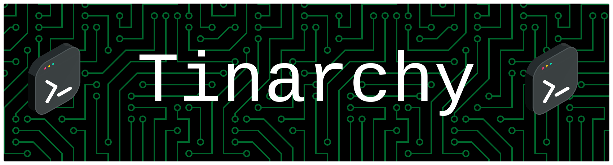
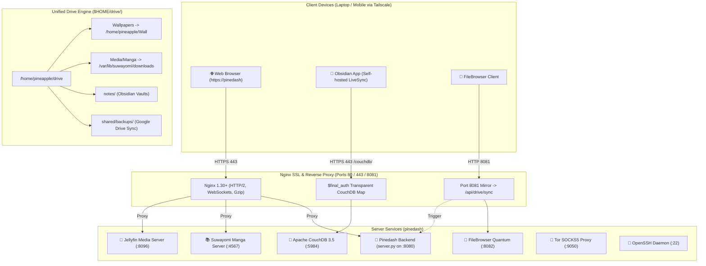

# 🍍 Pinedash (Pinedash Server Ecosystem)



[](https://archlinux.org)
[](https://python.org)
[](https://nginx.org)
[](https://tailscale.com)
[](https://couchdb.apache.org)
[](https://1.1.1.1)

A fast, lightweight, and translucent glassmorphic control center for self-hosted Linux home servers and headless machines. Built with native Python, Nginx reverse proxying, dynamic **Pywal** theming, automated **$HOME/drive/** synchronization, encrypted **DNS-over-TLS**, and passwordless **Obsidian LiveSync** mesh access.

---

## 🌟 Key Features

### 1. 🎨 Dynamic Pywal Color Engine & Animated Live Wallpapers
- **Automatic Palette Extraction**: Automatically samples color palettes from 150+ static images and animated MP4 video files.
- **Luminance-Boosted Accents**: Intelligently tunes lightness ($L \in [0.72, 0.85]$) and saturation so accents, buttons, and progress bars shine crisply against dark frosted glass.
- **Ultra-Fast Thumbnail Cache**: Pre-renders lightweight 2 KB `.webp` thumbnails for instant (< 15ms) wallpaper switching with zero 502 gateway timeouts.
- **Universal `::selection` Theming**: Highlights selected text across all pages in the active wallpaper's primary accent color.

### 2. ⚡ Multi-Trigger `$HOME/drive/` Synchronization Engine
- **Unified File Access**: Consolidates wallpapers, manga downloads, media libraries, Obsidian note vaults, and personal archives into a clean `$HOME/drive/` directory hierarchy with zero disk duplication.
- **Automated Triggers**: A debounced background sync engine (`pinedash-drive-sync`) automatically synchronizes symlinks, permissions, and database archives on:
  1. System boot (`pinedash-drive-sync.service`)
  2. File manager service restart (`filebrowser-quantum.service`)
  3. External HTTP access on port `8081` (via Nginx subrequest mirror)
- **Interactive Dashboard Tile**: A reformatted stat card in the dashboard provides live status (`Synced · Just now`) and a tactile **`[ ⚡ Sync Now ]`** trigger with spring animations.

### 3. 🔮 Passwordless Obsidian LiveSync via Tailscale Mesh
- **Native Apache CouchDB 3.5**: Runs as a lightweight systemd unit (~81 MB RAM) for real-time, end-to-end encrypted note vault synchronization.
- **Tailscale WireGuard Security**: Requests arriving through your private Tailscale network (`https://pinedash/couchdb/`) are transparently authorized via Nginx `$final_auth` mappings. Clients leave username and password completely blank in Obsidian.

### 4. 🛡️ Cloudflare 1.1.1.1 DNS-over-TLS (DoT)
- **Encrypted DNS Queries**: Outbound queries (package updates, manga scrapers, and media metadata) are encrypted over TLS (port 853) using Cloudflare `1.1.1.1` and `1.0.0.1` with DNSSEC cryptographic validation.
- **Tailscale Split-DNS**: Tailscale MagicDNS (`100.100.100.100`) continues resolving `*.ts.net` peer devices in **1.6ms**.

### 5. 🌐 Friendly URL & Unified SSL SAN Certificates
- **Friendly Domain**: Access your dashboard directly via **`https://pinedash`** or `https://pinedash`.
- **Unified SAN Certificate**: A single self-signed Root CA issues full-chain certificates covering `pinedash`, `pinedash`, and IP addresses with zero browser security alerts.

### 6. 🧅 Tor Anonymity Proxy & Global Tailnet Exit Routing
- **Per-Service Tor Toggle**: Route Suwayomi manga scrapers through the Tor onion network with a single switch.
- **Global Tailscale Exit Node**: Dynamically re-routes all client Tailscale traffic through the Tor onion network using `iptables` NAT tables.

### 7. 📊 Live System Telemetry & Service Control
- Real-time CPU thermals (°C), CPU load average, RAM memory allocation, storage disk quotas, and one-click start/stop controls for all managed systemd daemons.
- Role-based permissions (`owner`, `admin`, `guest`) with concurrent session management (capped at 5 active sessions per user).

---

## 🏗️ System Architecture



---

## 🚀 Quick Start Guide

### 1. Prerequisites (Arch Linux / Debian)
Install essential system dependencies:
```bash
# Arch Linux
sudo pacman -S python python-pillow nginx couchdb tor iptables tailscale rclone

# Debian / Ubuntu
sudo apt install python3 python3-pil nginx couchdb tor iptables rclone
```

### 2. Clone the Repository
```bash
git clone https://github.com/T1n777/Tinarchy.git /home/pineapple/server-dashboard
cd /home/pineapple/server-dashboard
```

### 3. Configure Dynamic Branding
Create or edit `app_config.json`:
```json
{
  "server_name": "pinedash",
  "project_name": "pinedash"
}
```

### 4. Deploy Systemd Services
Copy and enable the dashboard service:
```bash
sudo cp server-dashboard.service /etc/systemd/system/
sudo systemctl daemon-reload
sudo systemctl enable --now server-dashboard.service
```

### 5. Setup Drive Synchronization
Deploy the multi-trigger sync engine:
```bash
sudo cp system/pinedash-drive-sync /usr/local/bin/
sudo chmod +x /usr/local/bin/pinedash-drive-sync
sudo cp system/pinedash-drive-sync.service /etc/systemd/system/
sudo systemctl enable --now pinedash-drive-sync.service
```

### 6. Configure Nginx Reverse Proxy
Deploy `system/nginx.conf`:
```bash
sudo cp system/nginx.conf /etc/nginx/nginx.conf
sudo nginx -t && sudo systemctl restart nginx
```

---

## ⚙️ Service Configuration Reference

Managed services are registered in `server.py` inside the `SERVICES` array:

```python
SERVICES = [
    {
        'id': 'suwayomi',
        'name': 'Suwayomi Server',
        'port': 4567,
        'systemd': 'suwayomi-server',
        'icon': '📚',
        'description': 'Manga library and reader',
        'torProxyEnabled': True
    },
    {
        'id': 'jellyfin',
        'name': 'Jellyfin Media Server',
        'port': 8096,
        'systemd': 'jellyfin',
        'icon': '🍿',
        'description': 'Movies, TV shows & media streaming'
    },
    {
        'id': 'tor',
        'name': 'Tor Proxy',
        'port': 9050,
        'systemd': 'tor',
        'icon': '🧅',
        'description': 'SOCKS5 anonymity proxy'
    },
    {
        'id': 'filebrowser',
        'name': 'File Manager',
        'port': 8081,
        'systemd': 'filebrowser-quantum',
        'icon': '📂',
        'description': 'Modern web-based file manager'
    },
    {
        'id': 'couchdb',
        'name': 'Obsidian LiveSync',
        'port': 5984,
        'systemd': 'couchdb',
        'icon': '🔮',
        'description': 'Real-time E2EE sync backend for Obsidian vaults'
    },
    {
        'id': 'sshd',
        'name': 'SSH Server',
        'port': 22,
        'systemd': 'sshd',
        'icon': '🔑',
        'description': 'Secure shell access'
    }
]
```

---

## 🔒 Security & Access Model

1. **Role-Based Access**:
   - `owner`: Full unrestricted administrative control, password changing, and user creation.
   - `admin`: Service start/stop/restart, Tor routing toggles, and wallpaper selection.
   - `guest`: Read-only view restricted to whitelisted service URLs (`GUEST_SERVICES`).
2. **Session Limits**: Maximum of 5 concurrent active browser sessions per user. Excess logins automatically purge the oldest session.
3. **Passwordless Tailscale Security**: Direct access over Tailscale WireGuard mesh can operate passwordless while external untrusted subnets require authentication.

---

## 📄 License
Released under the [MIT License](LICENSE). Built for self-hosters, home lab enthusiasts, and modern Linux power users.
