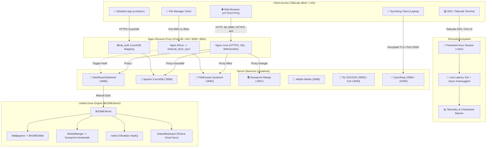

# 🍍 Pinedash (Server Ecosystem & Control Center)


[](https://archlinux.org)
[](https://python.org)
[](https://nginx.org)
[](https://tailscale.com)
[](https://couchdb.apache.org)
[](https://syncthing.net)
[](https://github.com/tmux/tmux)
[](https://1.1.1.1)

A fast, lightweight, and translucent glassmorphic control center for self-hosted Linux home servers and headless machines. Built with native Python, unified Nginx reverse proxying, dynamic **Pywal** theming, automated **$HOME/drive/** synchronization, encrypted **DNS-over-TLS**, passwordless **Obsidian LiveSync**, **Tor anonymity routing**, persistent **Tailscale SSH & tmux** sessions, and **hardware display power management**.

---

## 🌟 Key Features

- **🎨 Dynamic Pywal Theming & Live Wallpapers**:
  - Automatically samples color palettes from 150+ static images and animated MP4 video files.
  - Intelligently tunes luminance ($L \in [0.72, 0.85]$) and contrast for frosted glass readability.
  - Pre-renders lightweight `.webp` thumbnails for instant, flicker-free wallpaper switching.
  - **Live Glassmorphic Sliders**: Real-time slider controls for background blur and glass translucency with immediate cross-page synchronization between `/settings` and the main dashboard.
  - **Adaptive Small-Screen Layouts**: Responsive single-column list view with compact tiles on mobile phones and small viewports without horizontal or vertical overflow.

- **⚡ Persistent Remote SSH & Terminal Ecosystem (tmux + Zsh + Fastfetch)**:
  - **Automatic Session Persistence**: Interactive SSH and Tailscale SSH logins automatically attach to a persistent `tmux` session (`main`). Running builds, downloads, and servers never get killed if Wi-Fi drops or your client machine sleeps.
  - **Pinedash-Themed tmux (`configs/tmux/tmux.conf`)**: Features 50,000 lines of scrollback, full mouse scrolling & selection, instant 0ms Esc-key modal switching for Vim/Neovim, truecolor RGB, and custom glass-matching status bar badges.
  - **Optimized Zsh Shell (`configs/zsh/zshrc`)**: Tuned for ultra-low latency over remote SSH connections with async autosuggestions, non-blocking buffer limits, and custom syntax highlighting colors.
  - **Interactive Telemetry & Cheatsheets**: Interactive shells automatically launch `fastfetch` with system metrics alongside a built-in tmux keyboard shortcuts reference table (`tmux-keys` / `shortcuts`).
  - **Bypass Flag**: Non-interactive commands execute directly; to bypass tmux in an interactive shell, simply connect with `NO_AUTO_TMUX=1 ssh ...`.

- **💻 Headless Laptop Server Display & Power Management**:
  - **True 0-Watt LCD Screen Sleep**: Configures VESA DPMS hardware powerdown (`bl_power = 4`, `actual_brightness = 0`) after 3 minutes of console inactivity instead of keeping the backlight burning.
  - **ACPI Lid Handling**: Automatically turns off the display backlight instantly when the laptop lid is closed while keeping all 24/7 background server processes, Tailscale, and Nginx running.
  - **Instant Keyboard Wake**: Hitting any key on the physical console immediately wakes up the screen with full brightness.

- **🌐 Unified Reverse Proxy & Smart Routing (Nginx)**:
  - Consolidates all web services under standard HTTP (`80`, `8080`) and HTTPS (`443`) ports.
  - Path-based routing: `/` (Dashboard), `/files/` (FileBrowser), `/couchdb/` (Obsidian LiveSync), `/manga/` & `/api/v1/` (Suwayomi), `/ssh` (Persistent SSH Guide).
  - Clean pseudo links: `/links/<service>` (`/links/files`, `/links/manga`, `/links/couchdb`, `/links/navidrome`, etc.) for direct browser redirection.
  - Dedicated legacy direct port (`8081`) for FileBrowser.

- **⚡ Multi-Trigger `$HOME/drive/` Synchronization Engine**:
  - Unifies storage (wallpapers, manga, note vaults, and media) into a clean `$HOME/drive/` hierarchy with zero duplication.
  - Debounced automated triggers:
    1. System boot via `pinedash-drive-sync.service`
    2. File uploads/changes in FileBrowser via Nginx mirror hook (`/internal_drive_sync`)
    3. Interactive dashboard button (`[ ⚡ Sync Now ]` at `/api/drive/sync`)
  - Automated cloud backups to Google Drive via rclone (`configs/scripts/backup-drive-to-gdrive.sh` + systemd timer).

- **🔮 Passwordless Obsidian LiveSync (Apache CouchDB 3.5)**:
  - Real-time, end-to-end encrypted note vault synchronization.
  - Transparent authorization mapping over Tailscale (`/couchdb/` via `$final_auth`).

- **🔄 Syncthing Continuous Encrypted Folder Sync**:
  - Continuous, decentralized real-time bidirectional folder sync between client laptops and the server.
  - Multi-tier zero-trust guest isolation: network-layer Tailscale ACL block, application-layer cryptographic mutual TLS device pairing, and dashboard-level RBAC route gating.
  - Dedicated step-by-step setup guide with one-click Device ID copying at `/syncthing`.

- **🧅 Tor SOCKS5 Proxy & Global Tailscale Exit Node**:
  - Standalone SOCKS5 proxy on `127.0.0.1:9050` with per-service toggling.
  - Global Exit Node routing: routes all Tailscale client traffic through Tor via `iptables` NAT tables, with intelligent auto-start when toggled.

- **👥 Role-Based Access Control (RBAC) & Tailscale Identity**:
  - Dynamic user and device identification via Tailscale Whois (no manual credentials required).
  - Tiers configured in `roles_config.json`:
    - `owner`: Full unrestricted telemetry, service controls, Tor exit node, and connected Tailnet device inspection.
    - `admin`: Service start/stop/restart and Tor proxy controls.
    - `viewer`: Read-only telemetry and allowed service links.
    - `guest`: Isolated view restricted to whitelisted services (e.g. personal Navidrome, FileBrowser); Tor exit node and Tailnet device sections are automatically hidden.
  - Robust multi-user identity resolution: prevents duplicate "You" badges across multiple connected devices on the same tailnet account.

- **🧩 Extensible Local Services (`services.local.json`)**:
  - Register machine-specific or private services (such as multi-user Navidrome instances) without touching Git-tracked code.

---

## 🏗️ System Architecture



---

## 📋 Port & Service Reference

| Service | Internal Port | External Path / Port | Systemd Service | Description |
| :--- | :---: | :---: | :--- | :--- |
| **Dashboard Backend** | `8085` | `/` (80, 8080, 443) | `server-dashboard.service` | Glassmorphic telemetry & control center |
| **FileBrowser Quantum** | `8082` | `/files/` & `:8081` | `filebrowser-quantum.service` | Modern web file manager with sync hook |
| **Obsidian LiveSync** | `5984` | `/couchdb/` | `couchdb.service` | Real-time E2EE note synchronization |
| **Syncthing Web GUI** | `8384` | `/syncthing` & `:8384` | `syncthing@<user>.service` | Continuous encrypted folder sync & device pairing |
| **Suwayomi Manga** | `4567` | `/manga/` & `/api/v1/` | `suwayomi-server.service` | Manga library server & WebUI reader |
| **Jellyfin Media** | `8096` | `:8096` | `jellyfin.service` | Movies, TV shows & media streaming |
| **Tor SOCKS5 Proxy** | `9050` | `:9050` | `tor.service` | SOCKS5 anonymity proxy |
| **Global Tor Exit Node** | `9040` / `5353` | `tailscale0` NAT | `tor_exit_node.sh` | Routes Tailnet client traffic over Tor |
| **SSH & tmux Persistence** | `22` | `:22` | `sshd.service` / `tmux` | Resilient remote sessions with auto-attach |

---

## 🚀 Quick Start & Installation

### 1. Prerequisites

Install core runtime dependencies:

```bash
# Arch Linux
sudo pacman -S python python-pillow nginx couchdb tor iptables tailscale rclone tmux zsh fastfetch syncthing

# Debian / Ubuntu
sudo apt update && sudo apt install -y python3 python3-pil nginx couchdb tor iptables rclone tmux zsh fastfetch
```

### 2. Clone the Repository

```bash
git clone https://github.com/T1n777/Tinarchy.git ~/server-dashboard
cd ~/server-dashboard
```

### 3. Configuration

#### A. Branding (`app_config.json`)
Set custom server and project names, or leave blank to automatically use the system hostname:
```json
{
  "server_name": "",
  "project_name": ""
}
```

#### B. Access Roles (`roles_config.json`)
Assign roles based on Tailscale login emails (`owner`, `admin`, `guest`, `viewer`):
```json
{
  "owner": "admin@example.com",
  "owner_name": "Admin",
  "roles": {
    "admin@example.com": "owner",
    "friend@example.com": "admin",
    "guest@example.com": "guest"
  },
  "default_role": "viewer"
}
```

#### C. Local Machine Services (`services.local.json`, Optional)
Add untracked machine-specific services (e.g. Navidrome instances):
```json
[
  {
    "id": "navidrome",
    "name": "Navidrome",
    "port": 4533,
    "systemd": "navidrome",
    "icon": "🎵",
    "description": "Personal Music Streaming Server"
  }
]
```

#### D. Environment Variables (`.env`, Optional)
```bash
PORT=8085
TAILSCALE_IP=100.x.y.z
```

---

### 4. Deploy Systemd Services

Deploy the dashboard unit file (verify paths in the file match your user directory):

```bash
# Deploy Dashboard service
sudo cp server-dashboard.service /etc/systemd/system/
sudo systemctl daemon-reload
sudo systemctl enable --now server-dashboard.service
```

Additional service unit templates are available under `configs/systemd/`:
- `filebrowser-quantum.service`
- `pinedash-drive-sync.service`
- `rclone-drive-backup.service` & `rclone-drive-backup.timer`
- `cloudflare-dot.conf` (DNS-over-TLS)
- `console-screen-blank.service` & `getty-powersave.conf` (Display powerdown)

---

### 5. Install the Drive Sync Engine

Set up the unified `$HOME/drive/` sync script and background service:

```bash
# Install sync binary
sudo cp configs/scripts/pinedash-drive-sync /usr/local/bin/
sudo chmod +x /usr/local/bin/pinedash-drive-sync

# Enable background boot trigger service
sudo cp configs/systemd/pinedash-drive-sync.service /etc/systemd/system/
sudo systemctl daemon-reload
sudo systemctl enable --now pinedash-drive-sync.service
```

---

### 6. Configure Nginx Reverse Proxy

1. Review and adjust `configs/nginx/nginx.conf` (ensure usernames, SSL certificate paths, and server names match your machine).
2. Copy configuration to `/etc/nginx/nginx.conf`:
   ```bash
   sudo cp configs/nginx/nginx.conf /etc/nginx/nginx.conf
   sudo nginx -t && sudo systemctl restart nginx
   ```

---

### 7. Configure Tor Exit Node (Optional)

Make the exit node script executable:
```bash
chmod +x ~/server-dashboard/tor_exit_node.sh
```

To allow the dashboard backend to toggle the Tor exit node without password prompts, add a sudoers rule (`sudo visudo -f /etc/sudoers.d/99-tor-exit`):
```text
%wheel ALL=(ALL) NOPASSWD: /home/*/server-dashboard/tor_exit_node.sh *
```

---

### 8. Configure Persistent SSH & Terminal (tmux + Zsh + Fastfetch)

Install the low-latency Zsh configuration, persistent tmux environment, and fastfetch cheatsheet banner:

```bash
# Copy and activate shell and tmux configs
cp configs/zsh/zshrc ~/.zshrc
cp configs/tmux/tmux.conf ~/.tmux.conf

# Install fastfetch cheatsheet banner
mkdir -p ~/.config/fastfetch
cp configs/fastfetch/config.jsonc ~/.config/fastfetch/config.jsonc
```

---

### 9. Headless Laptop Display Powerdown (Optional)

For home server laptops running 24/7 with the lid open or closed, enforce true hardware DPMS backlight shutoff after 3 minutes of console inactivity:

```bash
# 1. Install systemd getty powersave drop-in (enforces root DPMS powerdown on login prompts)
sudo mkdir -p /etc/systemd/system/getty@.service.d
sudo cp configs/systemd/getty-powersave.conf /etc/systemd/system/getty@.service.d/powersave.conf

# 2. Install interactive shell powersave trigger
sudo cp configs/scripts/console-powersave.sh /etc/profile.d/console-powersave.sh

# 3. Add consoleblank=180 to GRUB_CMDLINE_LINUX_DEFAULT in /etc/default/grub and update GRUB:
sudo grub-mkconfig -o /boot/grub/grub.cfg

# 4. Reload systemd
sudo systemctl daemon-reload
```

---

## 🛠️ Management & Useful Commands

| Task | Command |
| :--- | :--- |
| **Check Dashboard Status** | `systemctl status server-dashboard` |
| **View Live Dashboard Logs** | `journalctl -u server-dashboard -f` |
| **Restart Dashboard Service** | `sudo systemctl restart server-dashboard` |
| **Trigger Manual Drive Sync** | `curl -X POST http://127.0.0.1:8085/api/drive/sync` |
| **Test Nginx Configuration** | `sudo nginx -t` |
| **Check Tor Exit Node Status** | `sudo iptables -t nat -L TOR_EXIT -n -v` |
| **Check Tailscale Peer Status**| `tailscale status` |
| **Attach to Persistent Terminal** | `tmux attach -t main` |
| **Bypass Persistent tmux on SSH** | `NO_AUTO_TMUX=1 ssh user@host` |
| **View Telemetry & tmux Cheatsheet** | `shortcuts` or `tmux-keys` or `ff` |

---

## 🔒 Security & Isolation Model

1. **Tailscale Whois Identity**: Authenticates users dynamically based on verified WireGuard mesh identities.
2. **Guest Isolation**: Guest accounts only see explicitly permitted services. Management toggles (Tor exit node, service daemons, and connected Tailnet peers) are excluded both from the API and the UI.
3. **Transparent LiveSync Authentication**: CouchDB credentials are mapped in Nginx (`$final_auth`), allowing seamless Obsidian syncing across the mesh without exposing raw database passwords to clients.
4. **Leak-Proof Tor Routing**: The Tor exit node script rejects non-TCP/DNS traffic and filters IPv6 to prevent accidental deanonymization.
5. **Persistent Session Sandboxing**: Remote SSH sessions are contained in detachable tmux sessions, preventing abrupt network drops from terminating background administration jobs.

---

## 📄 License

Released under the [MIT License](LICENSE). Built for self-hosters, home lab enthusiasts, and Linux power users.
